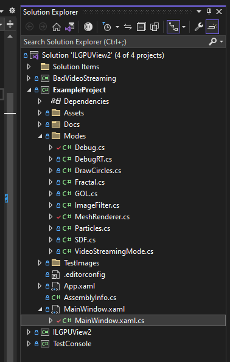

# Tutorial 0: Getting Started with ILGPUView2

In this tutorial, I'll guide you through the initial steps to get up and running with the ILGPUView2 toolkit.

#### What is ILGPUView2?

ILGPUView2 is a creative coding toolkit that I wrote to make it faster and easier for me to experiment with more generalized GPU accelerated code. 

#### Prerequisites:

- A Windows device, preferably with an nvidia GPU.
- [Visual Studio 2022](https://visualstudio.microsoft.com/downloads/) with the .NET Desktop Development workload.
- A GitHub account.

# Setup:

#### 0. Download [Visual Studio 2022](https://visualstudio.microsoft.com/downloads/).
#### 1. [Fork](https://docs.github.com/en/get-started/quickstart/fork-a-repo) the [ILGPUView2 repository](https://github.com/NullandKale/ILGPUView2).
#### 2. [Clone](https://learn.microsoft.com/en-us/visualstudio/version-control/git-clone-repository?view=vs-2022) your new instance of the Repo.
#### 3. Open the freshly downloaded ILGPUView2 project in Visual Studio 2022.

# The Code:

<p float="left">

</p>

You should see the following projects in the solution:

- **BadVideoStreaming**
- **TestConsole**
- **ILGPUView2**
- **ExampleProject**

**ExampleProject** is where you will spend most of your time in these tutorials. This WPF project uses ILGPUView2 to render via render modes, making it the primary point of entry.

**ILGPUView2** is the heart of the render engine. If you're curious about the engine's inner workings, this is your go-to. Theoretically, it's feasible to port this to OpenTK or Avalonia for cross-platform compatibility. I've done both, and it's entirely possible, but currently outside this project's scope, unless I find it necessary for some reason.

You can ignore **BadVideoStreaming** and **TestConsole** for this tutorial. They pertain to a custom video streaming library I wrote and use in an example rendermode. **TestConsole** is just a test application for the **BadVideoStreaming**.

## ExampleProject:

After opening the `ExampleProject`, the first file to look at is [MainWindow.xaml.cs](../MainWindow.xaml.cs). You can consider this to be the entry point of the application.

In general you won't need to touch the code in this file, but as its the entry point, I think its a sensible place to start.

The `MainWindow` class serves multiple purposes:

1. **Initialization of Render Modes**: The available render modes for the application are initialized and added to the `RenderManager`.
2. **UI Setup**: The `UIBuilder` is responsible for dynamically creating the settings UI based on the active render mode. This UI appears within the primary `MainWindow`.
3. **Render Mode Management**: The `RenderManager` takes charge of transitioning between different render modes, depending on the SetRendermMode() call.

Let's dissect the key parts of the code:
```csharp
public partial class MainWindow : Window, IDisposable
{
    // This manages the renderer, the render window state, and the rendermodes
    public RenderManager renderManager;

    public MainWindow()
    {
        InitializeComponent();

        renderManager = new RenderManager();

        // Setup the UIBuilder
        UIBuilder.SetFPSCallback((string fps) => { label.Content= fps; });
        UIBuilder.SetUIStack(rendermode_ui);
        
        AddRenderModes();
    }

    // Instantiate and add available render modes to the manager
    public void AddRenderModes(int default_mode = 9)
    {
        renderManager.AddRenderCallback(0, new Modes.Debug());
        // ... [Add other render modes as needed]

        // Populate the dropdown with render mode names
        mode.ItemsSource = new string[] 
        {
            "Debug",
            // ... [Names of other render modes]
        };

        // Update the active render mode based on dropdown selection
        mode.SelectionChanged += (sender, args) =>
        {
            if (mode.SelectedIndex != -1)
            {
                // this actually does the magic and sets the active rendermode
                renderManager.SetRenderMode(mode.SelectedIndex);
            }
        };

        // Load the default render mode upon startup
        mode.SelectedIndex = default_mode;
    }
}
```

## Working with Render Modes:

In `ILGPUView2`, we need a way to manage the state for each rendermode, this is done with the interface IRenderCallback. 

```csharp
public interface IRenderCallback
{
    // this is called whenever 0 - 9 are pressed on the keyboard
    // to quickly change state in a rendermode
    // this is legacy and will likely get removed
    public void SetMode(int mode);

    // this is called with the key events from WPF, not perfect keyboard input for sure, but it works
    public void OnKeyPressed(Key key, ModifierKeys modifiers);

    // this allows you access to the RenderWindow which allows you to change the size and to force things like position and fullscreen mode.
    // in general you can just return (newWidth, newHeight, false) to just use the normal windowing behavior
    public (int xSize, int ySize, bool update) BeforeResolutionChanged(RenderWindow renderWindow, int newWidth, int newHeight);

    // Lifecycle call, called when the rendermode is first started.
    public void OnStart(Renderer gpu);

    // Defines the UI elements associated with the render mode
    // Called After OnStart()
    public void CreateUI();

    // this is called once per frame,
    // before gpu.framebuffer is to be displayed on screen.
    // this is where you should actually draw to the screen
    public void OnRender(Renderer gpu);

    // this is called once per frame, 
    // after gpu.framebuffer is displayed on the screen.
    public void OnLateRender(Renderer obj);

    // Lifecycle call, called with the rendermode is disposing.
    public void OnStop();
}
```

#### Structure of the Debug Render Mode:

The `Debug` class implements the `IRenderCallback` interface, but only uses two functions:

```csharp
public class Debug : IRenderCallback
{
    // other IRenderCallback functions omitted for length

    public void CreateUI()
    {
        UIBuilder.Clear();
        UIBuilder.AddLabel("Debug Renderer");
    }

    public void OnRender(Renderer gpu)
    {
        gpu.ExecuteFilter<DebugFilter>(gpu.framebuffer);
    }

    public (int xSize, int ySize, bool update) BeforeResolutionChanged(RenderWindow renderWindow, int newWidth, int newHeight)
    {
        return (newWidth, newHeight, false);
    }
}
```

* `CreateUI()`: . In this example, it simply adds a label to the UI.
* `OnRender(Renderer gpu)`: Here, the `DebugFilter` is executed on the GPU's framebuffer.


The line: `gpu.ExecuteFilter<DebugFilter>(gpu.framebuffer);` in the OnRender function draws the output of the Apply() function in the DebugFilter struct onto the gpu.Framebuffer GPUImage. 

Below is the `DebugFilter` struct implements the `IImageFilter` interface, which is responsible for defining the pixel values in the framebuffer:

```csharp
public struct DebugFilter : IImageFilter
{
    // tick is a frame count starting at 0
    // x and y are the position in the framebuffer in the domain [0, 1]
    public RGBA32 Apply(int tick, float x, float y, dImage framebuffer)
    {
        // creates a checkered pattern
        if ((int)(x * 10) % 2 == (int)(y * 10) % 2)
        {
            // blue to red gradient
            return new RGBA32((byte)(x * 255), 0, (byte)(y * 255), 255);
        }
        else
        {
            // outputs grey color corresponding to the tick value
            return new RGBA32((byte)(tick % 255), (byte)(tick % 255), (byte)(tick % 255), 255);
        }

    }
}
```

## Renderer Theory of Operation:

ILGPUView2 is based off of a trick you can do with ILGPU kernels where you to pass interfaces into kernels and then use those kernels to run the code that the interface implementor writes. The only weird trick is you need to compile the kernel with a concrete unmanaged implementor of the interface, so we need to cache multiple instances of the kernel in the renderer. 

I extensively use partial classes for the Kernels and Renderer classes to avoid HUGE files of disconnected code, each different parameter set you want to send to through a kernel requires a different interface and the requisite support functions.

Below is the code where we implement the Renderer.ExecuteFilter() function:

```csharp
public interface IImageFilter
{
    RGBA32 Apply(int tick, float x, float y, dImage output);
}

public static partial class Kernels
{
    public static void ImageFilterKernel<TFunc>(Index1D index, int tick, dImage output, TFunc filter) where TFunc : unmanaged, IImageFilter
    {
        int x = index.X % output.width;
        int y = index.X / output.width;

        double u = (double)x / (double)output.width;
        double v = (double)y / (double)output.height;

        output.SetColorAt(x, y, filter.Apply(tick, (float)u, (float)v, output));
    }
}

public partial class Renderer
{
    public void ExecuteFilter<TFunc>(GPUImage output, TFunc filter = default) where TFunc : unmanaged, IImageFilter
    {
        var kernel = GetFilterKernel(filter);
        kernel(output.width * output.height, ticks, output.toDevice(this), filter);
    }

    private Action<Index1D, int, dImage, TFunc> GetFilterKernel<TFunc>(TFunc filter = default) where TFunc : unmanaged, IImageFilter
    {
        if (!kernels.ContainsKey(filter.GetType()))
        {
            var kernel = device.LoadAutoGroupedStreamKernel<Index1D, int, dImage, TFunc>(ImageFilterKernel);
            kernels.Add(filter.GetType(), kernel);
        }

        return (Action<Index1D, int, dImage, TFunc>)kernels[filter.GetType()];
    }
}
```