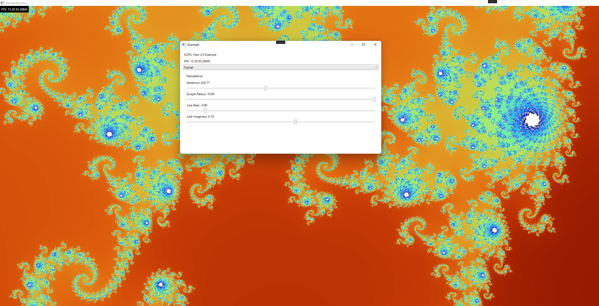
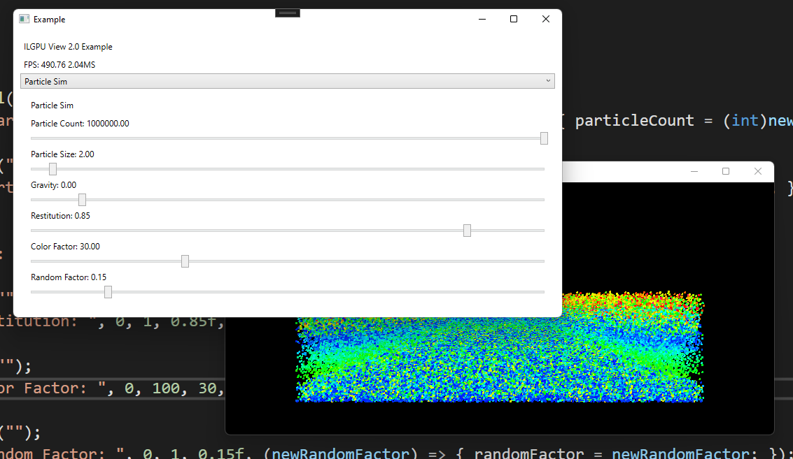

# ILGPUView2

ILGPU is a WPF library and a project template for creating and experimenting with GPGPU programming in C# with ILGPU

<p float="left">


</p>

Above are some screenshots of the DebugRT example. A single file sphere ray tracer written with the assistance of ChatGPT

# How to get started as fast as possible!

1. Setup Visual Studio 2022, be sure to select the .net desktop development workload in the installer
2. Fork this repo
3. Open ILGPUView2.sln
4. Open ExampleProject/Modes/Debug.cs

# Example Render Mode

```csharp
public class Debug : IRenderCallback
{
    // this is called when the object is attatched to the MainWindow
    // and allows you to create UI and respond to buttons, sliders, 
    // and other UI elements
    public void CreateUI()
    {
        UIBuilder.Clear();
        UIBuilder.AddLabel("Debug Renderer");
    }

    // this is called once per frame, and is where you run filter calls
    public void OnRender(Device gpu)
    {
        // this executes the DebugFilter struct written below on the gpu.framebuffer object
        gpu.ExecuteFilter<DebugFilter>(gpu.framebuffer);
    }

    // unused here, but called when the Debug render mode is selected
    public void OnStart(Device gpu)
    {

    }

    // unused here, but called when the Debug render mode is destroyed
    public void OnStop()
    {

    }

    // unused here, but sends the number keys to the render mode
    // for quick mode switching
    public void SetMode(int mode)
    {

    }

    // unused old code needs to be deleted lol
    public void SetOption(int option)
    {

    }
}

// this specifies an IImageFilter which just writes to a framebuffer object
// 
// IImageFilter is only one of many filter types.
public struct DebugFilter : IImageFilter
{

    // this works very much like a fragment shader call. 
    // x and y are the normalized uv coords for the texture being written
    // tick is the framenumber
    // framebuffer is the current framebuffer being written
    public RGBA32 Apply(int tick, float x, float y, dImage framebuffer)
    {
        if ((int)(x * 10) % 2 == (int)(y * 10) % 2)
        {
            return new RGBA32((byte)(x * 255), 0, (byte)(y * 255), 255);
        }
        else
        {
            return new RGBA32(0, 0, 0, 255);
        }

    }
}
```

# List of Example modes:

<p float="left">

</p>
Debug | Renders the debug example above

-------------------------------------------------------

<p float="left">

</p>
GOL | Renders a random Game of Life state and updates every frame

-------------------------------------------------------

<p float="left">

</p>
DebugRT | Ray tracing demo with reflections and TAA

-------------------------------------------------------

<p float="left">

</p>
Fractal | Mandelbrot and Julia Sets with WASD + QE controls!

-------------------------------------------------------

<p float="left">

</p>
Particle Sim | Simple Particle Simulation

-------------------------------------------------------

<p float="left">

</p>
Image Filters | Loads an image and applys one of 15 filters

-------------------------------------------------------

# How to Contribute

Got an idea for improving ILGPU View 2.0? Great! Here are a few ways to get involved:

* Open an issue on GitHub to report a bug or suggest a feature
* Fork the repo and make changes yourself, then submit a pull request
* Spread the word about ILGPU View 2.0 to other developers who might be interested

I welcome all contributions and appreciate your help in making ILGPU View 2.0 even better!

# Project Goals / History
ILGPU View 2.0 is an evolution of an old project (ILGPUView) that I had created with the intention of making something similar to shader toy. 

The original goals where as follows: 

1. Be like shader toy.
2. Be easy to program.
3. Make experimenting easy.

This was a great starting point, but had a few blockers that made developing ILGPUView 1.0 kinda unfun. I don't want to spend time or effort making a text editor when I already have perfectly good editors like Visual Studio or Visual Studio Code. 

You can see ILGPUView [here](https://github.com/NullandKale/ILGPUView/). I am unsure if it even works anymore.

Instead I wanted to focus on ease of use for ILGPU View 2.0

The ILGPU View 2.0 goals:

1. Be easy to program.
2. Allow for concise programs.
3. Make experimenting easy.
4. Be easy to get started.
